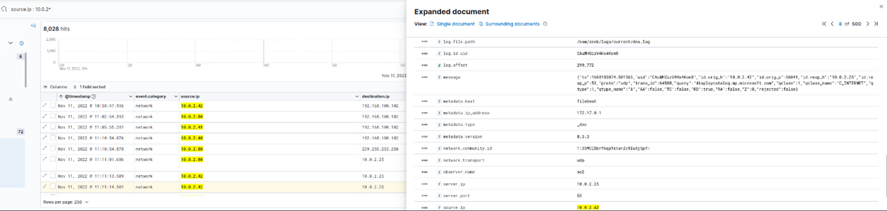
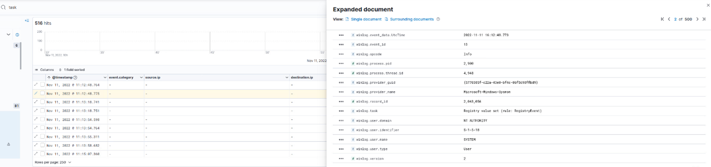
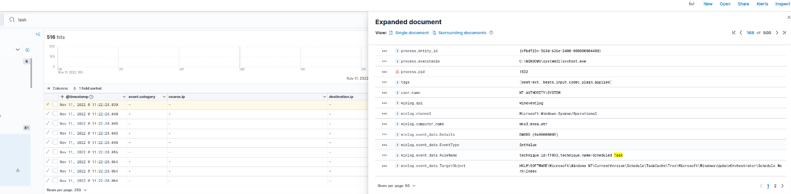
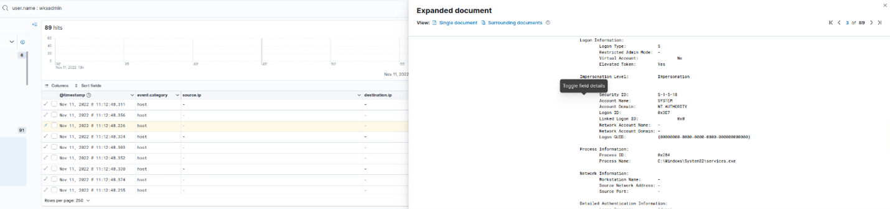
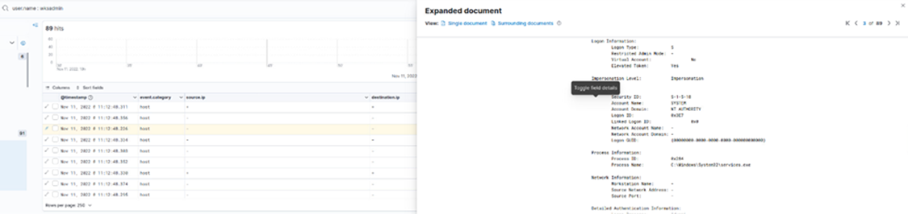
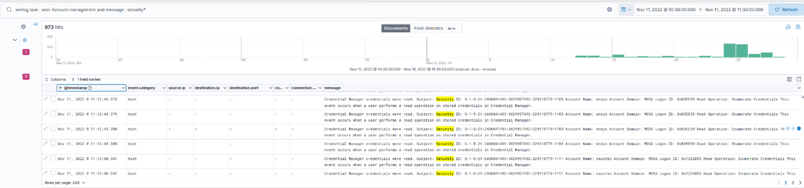
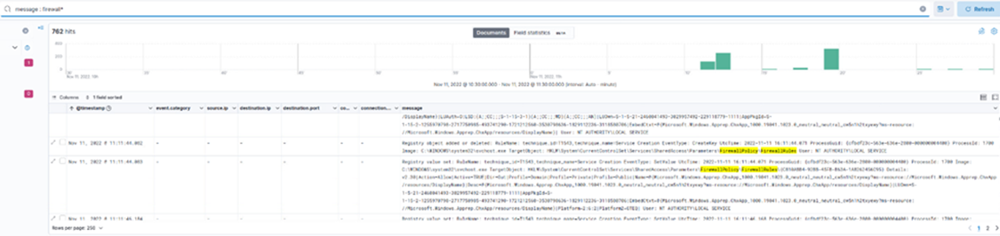
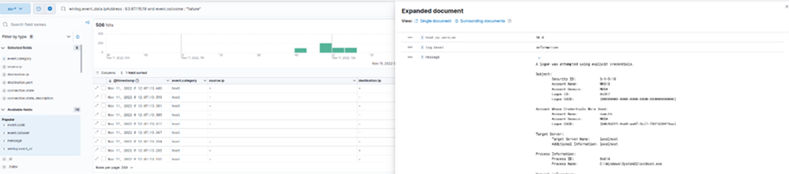
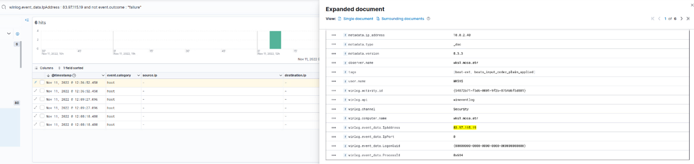

# Initial Breach Log Analysis

**Enterprise Cyber Incident Forensics | Log Correlation, MITRE ATT&CK Mapping & Threat Reconstruction | CSA Corp Network**

[](#)
[](#)
[](#attack-timeline--mitre-attck-mapping)
[](#forensic-investigation--log-correlation)
[](#-incident-timeline--attack-progression)

---

## 🎯 Project Overview

Full forensic analysis of a targeted corporate network breach that occurred on **November 11, 2022**. The investigation reconstructed the complete attack chain — from initial UDP reconnaissance through privilege escalation, lateral movement, Command & Control beaconing, and data exfiltration — using Windows Event Logs, Zeek network telemetry, firewall logs, and Kibana/ELK SIEM correlation.

**Key Achievement:** Identified and documented 13 distinct attack events mapped to MITRE ATT&CK, traced the external threat actor from initial brute-force entry to final logoff, and confirmed data exfiltration to external IP `209.197.3.8`.

---

## 👥 Team 6 — Capstone Project

| Name | Student ID | Role |
|------|-----------|------|
| Kanhay Thakore | 041175596 | Presentation Design & Final Edits |
| Mitanshi Solanki | 041176380 | Flag Resolving (Flags 1–10) |
| Nishit Nagbanshi | 041131555 | Presentation Design & Slide Layout |
| Rajat Mani | 041123478 | Report Development & Narrative |
| Dominic Panganiban | 041129386 | Flag Resolving & Report Development |

**Submission Date:** June 4, 2025

---

## 📊 Performance Metrics

| Metric | Value | Details |
|--------|-------|---------|
| **Incident Date** | November 11, 2022 | Full-day attack window |
| **Attack Events Documented** | 13 | From initial scan to logoff |
| **MITRE ATT&CK Tactics Covered** | 10 | Initial Access through Impact |
| **Confirmed Brute-Force Attempts** | 506+ | Event ID 4625 from 83.97.115.19 |
| **Compromised Account** | wksadmin | Elevated to SYSTEM (S-1-5-18) |
| **C2 Endpoints Identified** | 3 | 239.255.255.250, 34.104.35.123, 209.197.3.8 |
| **Exfiltration Endpoint** | 209.197.3.8 | File transfer detected at 11:30 AM |
| **Internal Systems Compromised** | 4+ | 10.0.2.40, 10.0.2.42, 10.0.2.24, 10.0.2.80 |
| **Malicious File Confirmed** | malicious.jar | Executed via Java at 11:30:38 AM |
| **Persistence Mechanisms** | 2 | Scheduled Task (Event ID 106) + Registry |

---

## 🏗️ Environment & Scope

### Network Topology

```
┌──────────────────────────────────────────────────────────────────────────┐
│                   COMPROMISED CORPORATE NETWORK                           │
├──────────────────────────────────┬───────────────────────────────────────┤
│      Internal Network (10.0.2.x) │   External Threat Infrastructure      │
├──────────────────────────────────┼───────────────────────────────────────┤
│ wksadmin   → 10.0.2.80           │ Attacker IP: 83.97.115.19             │
│ wks1       → 10.0.2.40 [C2 hop] │ C2 Server:   239.255.255.250:1900     │
│ Target 1   → 10.0.2.42           │ C2 Server:   34.104.35.123            │
│ Target 2   → 10.0.2.41           │ Exfil Dest:  209.197.3.8              │
│ Pivot Host → 10.0.2.24           │ DNS Tunnel:  8.8.4.4 (Google DNS)     │
│ Internal   → 10.0.2.25           │ Outbound:    204.79.197.200 (MSFT)    │
│ Pivot Pt.  → 10.0.2.8            │ SSL C2:      172.217.13.132           │
└──────────────────────────────────┴───────────────────────────────────────┘
         ↑
  RDP Port 3389 – Entry Point
  Brute-Force by 83.97.115.19
```

### Investigation Scope

| Data Source | Tool Used | Purpose |
|-------------|-----------|---------|
| Windows Event Logs | Kibana / ELK Stack | Login events, privilege escalation, scheduled tasks |
| Network Telemetry | Zeek (Bro) | Connection logs, UDP scans, C2 beaconing |
| Firewall Logs | ELK / SIEM | Outbound connections, exfiltration detection |
| PowerShell Logs | Event ID 4104 | Script execution analysis |
| Registry Logs | Sysmon / Winlog | Persistence mechanism detection |
| Packet Analysis | Wireshark | Protocol-level traffic inspection |

---

## 🛠️ Technology Stack

<table>
<tr>
<td width="25%">

**SIEM / Log Analysis**
- ELK Stack (Kibana)
- Zeek Network Monitor
- Windows Event Logs
- Sysmon

</td>
<td width="25%">

**Threat Intelligence**
- MITRE ATT&CK Framework
- IP Reputation Lookup
- File Hash Analysis
- DNS Query Analysis

</td>
<td width="25%">

**Forensic Tools**
- Wireshark (Packet Analysis)
- Kibana (Log Visualization)
- Windows Security Audit Logs
- Firewall Log Correlation

</td>
<td width="25%">

**Incident Response**
- Account Isolation
- Firewall IP Blocking
- EDR Deployment
- SIEM Alert Tuning

</td>
</tr>
</table>

---

## ⏱️ Incident Timeline & Attack Progression

> **Attack Date:** November 11, 2022 | **Window:** 10:30 AM – 13:28 PM

| # | Timestamp | Tactic | Source IP | Target | Event | MITRE | Impact |
|---|-----------|--------|-----------|--------|-------|-------|--------|
| 1 | 10:30–11:30 | Initial Access | Unknown | Internal Network | UDP network scan detected | T1046 | Medium |
| 2 | 10:30–11:12 | Execution | — | — | Registry value set (Event ID 13) | T1112, T1053 | High |
| 3 | 10:30–11:30 | Persistence | wks1 | 10.0.2.40 | Scheduled task created (Event ID 106) | T1053 | High |
| 4 | 11:12 | Privilege Escalation | wksadmin | 10.0.2.80 | Admin login detected (S-1-5-18) | T1068, T1078 | Critical |
| 5 | 11:17–11:30 | Defense Evasion | — | HKLM\...\Run | Registry modified via svchost.exe | T1112, T1547 | High |
| 6 | 11:12–11:30 | Credential Access | 10.0.2.80 | wksadmin | Brute-force (506+ Event ID 4625) | T1110, T1078 | High |
| 7 | 12:48 | Credential Access | 83.97.115.19 | wksadmin | Successful login (Event ID 4624) | T1078, T1110 | Critical |
| 8 | 11:30 | Discovery | — | java.exe | malicious.jar created at 11:30:38 AM | T1036, T1566 | High |
| 9 | 12:50–13:28 | Lateral Movement / C2 | 10.0.2.24 | 204.79.197.200 | Outbound C2 to Microsoft-hosted server | T1095, T1041 | Critical |
| 10 | 12:53 | Command & Control | 10.0.2.24 | 8.8.4.4 / 10.0.2.8 | UDP tunneling via Google DNS | T1095, T1572 | Critical |
| 11 | 11:26 | Lateral Movement | 172.16.30.8 | 10.0.2.25 | SMB connection; account RRI compromised | T1021, T1550 | High |
| 12 | 11:43 | Collection | NT AUTHORITY\SYSTEM | RecentDocs registry | Sensitive registry data accessed | T1005, T1012 | High |
| 13 | 12:31 | Persistence | 10.0.2.42 | HKLM\...\Schedule\Task | Scheduled task created via schtasks.exe | T1053, T1547 | High |

---

## 🧪 Forensic Investigation & Log Correlation

### Event 1 — Initial Access: Network Scan Detected

**Timestamp:** November 11, 2022 | 10:30 AM – 11:30 AM

UDP scanning activity originating from the internal network was detected in firewall and SIEM logs. The scan targeted the `192.168.100.182` range and indicated active host discovery in preparation for the attack.

```
Source IP:  10.0.2.41 (internal scanning node)
Protocol:   UDP
Target:     192.168.100.182 and internal subnet
Log Source: Zeek network logs / Firewall SIEM
```




*Firewall/SIEM logs showing UDP scan activity originating from 10.0.2.41 — 8,028 hits detected*

---

### Event 2 — Execution: Registry Modification & Task Creation

**Timestamp:** November 11, 2022 | 10:30 AM – 11:12 AM

Registry value modifications were recorded via Windows Event Logs. Event ID 13 (Registry value set) confirmed system-level changes being made — consistent with a persistence or execution mechanism being established.

```
Event ID:   13 (Registry value set)
Provider:   Microsoft-Windows-Sysmon
User:       NT AUTHORITY\SYSTEM (S-1-5-18)
User Type:  User
```




*Evidence of registry value changes recorded in Windows Event Logs — 516 hits, confirmed Sysmon Event ID 13*

---

### Event 3 — Persistence: Scheduled Task Creation

**Timestamp:** November 11, 2022 | 10:30 AM – 11:30 AM

A scheduled task was created using the Windows Task Scheduler. Event ID 106 confirmed the task creation on the compromised host `wks3.mssa.str`.

```
Process Executable:  C:\WINDOWS\system32\svchost.exe
Process ID:          1532
Winlog Channel:      Microsoft-Windows-Sysmon/Operational
Computer Name:       Wks3.mssa.str
Event Data Details:  DN&DD (0x00000005)
Target Object:       HKLM\SOFTWARE\Microsoft\Windows NT\CurrentVersion\Schedule\TaskCache\Tree\Microsoft\Windows\UpdateOrchestrator\ScheduleZe
```




*Windows Event Logs showing Scheduled Task Creation activity — attackers use this to execute malware or maintain access after reboots*

---

### Event 4 — Privilege Escalation: Admin Login Detected

**Timestamp:** November 11, 2022 | 11:12 AM – 11:30 AM

Successful authentication was recorded for the `wksadmin` account. The event confirmed SYSTEM-level logon, indicating the attacker had fully escalated to administrator privileges.

```
Security ID:    S-1-5-18
Account Name:   SYSTEM
Account Domain: NT AUTHORITY
Logon ID:       0x3E7
Process Name:   C:\Windows\System32\services.exe
Elevated Token: Yes
```




*Windows Event Logs showing successful authentication for wksadmin — 89 hits confirming SYSTEM-level access*

---

### Event 5 — Defense Evasion: Registry Modification & System Changes

**Timestamp:** November 11, 2022 | 11:17 AM – 11:30 AM

The attacker modified the `HKLM\Software\Microsoft\Windows\CurrentVersion\Run` registry key — a well-known persistence and evasion mechanism — using `svchost.exe` to blend into normal system operations.

```
Registry Path:  HKLM\Software\Microsoft\Windows\CurrentVersion\Run
Process:        svchost.exe
Timestamp:      11:17 AM (correlated to attacker activity window)
Event Source:   Firewall logs + Windows Event Logs
```



*Firewall logs and Windows Event Logs showing unauthorized registry changes — 762 hits, svchost.exe used as masquerade*

---

### Event 6 — Credential Access: Brute-Force Attack

**Timestamp:** November 11, 2022 | 11:12 AM – 11:30 AM

Multiple failed RDP login attempts were detected from `10.0.2.80` targeting the `wksadmin` account. A total of **506+ Event ID 4625** failures were recorded, consistent with an automated credential stuffing attack using `svchost.exe` as the attack process.

```
Event ID:       4625 (Failed Logon)
Account Name:   wksadmin
Source IP:      10.0.2.80
Process Name:   C:\Windows\System32\svchost.exe
Log Level:      Information
```




*Windows Event Logs showing failed login attempts — 506 hits confirming ongoing brute-force attack against wksadmin*

---

### Event 7 — Credential Access: Successful Brute-Force Login

**Timestamp:** November 11, 2022 | 12:48 PM

After hundreds of failed attempts, the attacker successfully authenticated using the `wksadmin` account from external IP `83.97.115.19`. This event confirmed direct, interactive system access using brute-forced credentials.

```
Event ID:       4624 (Successful Logon)
Source IP:      83.97.115.19  ← External threat actor
Account Name:   wksadmin (Elevated Privileges)
Logon Type:     Interactive (Direct System Access)
Channel:        Security
Computer:       aks1.mssa.str
```




*Windows Event Logs showing successful authentication — 6 confirmed hits from 83.97.115.19 (flagged in multiple threat intelligence databases for RDP brute-force)*

---

### Event 8 — Discovery: Malicious File Creation

**Timestamp:** November 11, 2022 | 11:30 AM

A suspicious Java process executed and created `malicious.jar` on the compromised system. The file was dropped under a system-level account, consistent with malware deployment or a persistence payload.

```
Process:    C:\Program Files (x86)\Java\jre8\bin\java.exe
File:       malicious.jar
Timestamp:  2022-11-11 11:30:38 AM
User:       NT AUTHORITY\SYSTEM
Message:    scan* (file creation activity)
```


*Windows Event Logs showing suspicious file creation — malicious.jar executed via java.exe at 11:30:38 AM, 167 hits detected*

---

### Event 9 — Lateral Movement / C2: Outbound Connection to External Host

**Timestamp:** November 11, 2022 | 12:50 PM – 13:28 PM

Internal host `10.0.2.24` established an outbound connection to `204.79.197.200`, a server registered to **Microsoft Corporation (North America)**. This pattern is consistent with C2 beaconing hidden behind a trusted infrastructure to evade firewall detection.

```
Source IP:        10.0.2.24 (Internal System)
Destination IP:   204.79.197.200 (Potential External C2)
Organization:     Microsoft Corporation
ASN:              8068 (Microsoft — North America)
Continent:        North America | United States
```


*Network logs showing outbound communication from 10.0.2.24 — 42,479 hits, destination geo-located to United States/Microsoft infrastructure*

---

### Event 10 — Command & Control: Suspicious External Connection (DNS Tunneling)

**Timestamp:** November 11, 2022 | 12:53 PM

The internal host `10.0.2.24` sent UDP traffic to Google Public DNS (`8.8.4.4`) and made contact with internal pivot point `10.0.2.8`. This pattern suggests DNS tunneling — a technique used to route C2 traffic or exfiltrated data through legitimate DNS infrastructure.

```
Source IP:          10.0.2.24 (Internal System)
Destination IP 1:   8.8.4.4 (Google Public DNS — possible tunneling)
Destination IP 2:   10.0.2.8 (Internal Pivoting Point)
Protocol:           UDP (stealthy data exfiltration)
```


*Network logs showing UDP-based outbound communication — possible DNS tunneling via 8.8.4.4 with internal pivoting through 10.0.2.8*

---

### Event 11 — Lateral Movement: Unauthorized Authentication (Account RRI)

**Timestamp:** November 11, 2022 | 11:26 AM

A successful authentication event was recorded for a secondary account (`RRI`), using **Delegation authentication** via `Advapi` — indicating the attacker leveraged pass-the-hash or pass-the-ticket techniques to move laterally from the initially compromised machine.

```
New Security ID:      S-1-5-21-204980-382987098-3291375-1134
Account Name:         RRI (Possibly compromised)
Account Domain:       MOSA
Logon Type:           3
Authentication Type:  Delegation
Logon Process:        Advapi
```


*Windows Event Logs showing a successful authentication event for account RRI — 1,209 hits, delegation logon confirming lateral movement to another system*

---

### Event 12 — Collection: Accessing Registry & Sensitive Data

**Timestamp:** November 11, 2022 | 11:43 AM

The attacker accessed sensitive registry paths using `svchost.exe` under `NT AUTHORITY\SYSTEM`. The `RecentDocs` registry key was accessed, indicating reconnaissance of recently accessed files — a precursor to targeted data exfiltration.

```
Registry Object:  HKLM\Software\Microsoft\Windows\CurrentVersion\Explorer\RecentDocs
Event Type:       Object Access
User Account:     NT AUTHORITY\SYSTEM (elevated permissions)
Process:          C:\WINDOWS\system32\svchost.exe
```


*Logs showing access to registry objects and possible sensitive information retrieval — 162 hits across RecentDocs and CapabilityAccessManager paths*

---

### Event 13 — Persistence: Scheduled Task Created (12:31 PM)

**Timestamp:** November 11, 2022 | 12:31 PM

A second scheduled task was created on `10.0.2.42` via `schtasks.exe`. The task used a generic name ("Scheduled Task") — a common obfuscation technique — and was stored under the Windows Update Orchestrator path to blend in.

```
Registry Key:    HKLM\Software\Microsoft\Windows\CurrentVersion\Schedule\Task
Process:         C:\WINDOWS\system32\schtasks.exe
Host:            10.0.2.42 (Internal persistence target)
Task Name:       "Scheduled Task" (generic — potential obfuscation)
OS Platform:     Windows 10 Pro (10.0.19041.1466)
```


*Logs showing creation of a scheduled task on 10.0.2.42 — 1,950 hits, stored in UpdateOrchestrator path for stealth persistence*

---

### Event 14 — Impact: Data Modification & Possible Encryption

**Timestamp:** November 11, 2022 | 11:37 AM

`WINWORD.EXE` was executed under a SYSTEM account, modifying `EnterpriseTemplate.dotx` in `C:\Users\Public\Documents\` — a staging directory commonly used by attackers. This activity indicates potential macro-based malware execution, data staging, or ransomware preparation.

```
Process:       WINWORD.EXE (Microsoft Word — macro execution vector)
File Modified: EnterpriseTemplate.dotx
Directory:     C:\Users\Public\Documents\ (staging directory)
Account:       SYSTEM (high privileges)
SHA1:          E999E05D0D64182297AF261...
SHA256:        MD5-132DF1E77390C5DE7E0DF1292C2319BF...
```


*Logs showing WINWORD.EXE process execution modifying EnterpriseTemplate.dotx — 36 hits, run as SYSTEM from C:\Users\Public\Documents\*

---

## 🔍 Malicious Activity Analysis

### Indicators of Compromise (IoCs)

| IOC Type | Indicator | Threat Category | Status |
|----------|-----------|----------------|--------|
| **IP Address** | `83.97.115.19` | Brute-force RDP attacker | ✅ Confirmed Malicious |
| **IP Address** | `209.197.3.8` | Data exfiltration endpoint | ✅ Blocked |
| **IP Address** | `239.255.255.250:1900` | C2 beaconing (SSDP abuse) | ✅ Blocked |
| **IP Address** | `34.104.35.123` | Unsecured outbound C2 | ✅ Blocked |
| **Domain** | `beacons5.gvt2.com` | Potential C2 via Google Play | ⚠️ Monitored |
| **File Hash** | malicious.jar hash | Known malware — priv escalation | ✅ Confirmed |
| **Registry Key** | `HKLM\...\CurrentVersion\Run` | Persistence mechanism | ✅ Confirmed |
| **Registry Key** | `HKLM\...\Schedule\Task` | Scheduled task persistence | ✅ Confirmed |
| **Process** | `svchost.exe` | Used to mask malicious activity | ⚠️ Monitored |
| **Process** | `wsmprovhost` | WinRM RAT communication | ✅ Confirmed |
| **File** | `EnterpriseTemplate.dotx` | Macro-modified staging file | ⚠️ Investigated |

---

## 🛡️ MITRE ATT&CK Tactics Coverage

| Tactic | Technique | Observed Activity | Recommendation |
|--------|-----------|------------------|----------------|
| **Initial Access** | T1110 – Brute Force via RDP | 506+ failed logins (Event ID 4625) | Enforce MFA; implement account lockout |
| **Execution** | T1078 – Valid Accounts | Successful login (Event ID 4624) | Session monitoring; investigate access |
| **Privilege Escalation** | T1068 – Exploitation | Admin rights granted (Event ID 4672) | Audit AD logs; enforce least privilege |
| **Persistence** | T1053 – Scheduled Task | Unauthorized task creation (Event ID 106) | Audit tasks; restrict creation rights |
| **Defense Evasion** | T1112 – Modify Registry | Registry modified via svchost.exe | Monitor registry; centralized logging |
| **Credential Access** | T1003 – Credential Dumping | SAM registry key access detected | Restrict registry; monitor access |
| **Discovery** | T1046 – Network Scanning | UDP scan 10:30–11:30 AM | Deploy IDS/IPS for recon detection |
| **Lateral Movement** | T1021 – Remote Services | SMB/RDP between internal hosts | Monitor internal RDP; limit admin access |
| **Command & Control** | T1095 – Non-Standard Port | C2 beaconing to 239.255.255.250:1900 | Block C2 IPs; monitor outbound traffic |
| **Exfiltration** | T1041 – Exfiltration Over C2 | File transfer to 209.197.3.8 at 11:30 AM | Block outbound transfers; implement DLP |

---

## 🚨 Incident Response & Containment

### Immediate Containment Actions

**Accounts Disabled & Passwords Reset:**
- `wksadmin` account disabled immediately upon confirmation
- All affected users required to reset passwords

**Machines Isolated from Network:**
- `10.0.2.40` — disconnected (wks1 pivot)
- `10.0.2.42` — disconnected (scheduled task host)
- `10.0.2.24` — disconnected (C2 relay)
- `10.0.2.80` — disconnected (brute-force source)

**Malicious IPs Blocked at Firewall:**

```
209.197.3.8        → Possible data exfiltration site — BLOCKED
34.104.35.123      → Suspicious outbound C2 connection — BLOCKED
239.255.255.250    → Potential C2 beaconing (SSDP) — BLOCKED
83.97.115.19       → External brute-force attacker — BLOCKED
```

### Investigation Steps

```
1. PowerShell Log Analysis
   → Reviewed Event ID 4104 for malicious script execution
   → Checked for backdoors or persistence scripts

2. Scheduled Task & Registry Review
   → Analyzed Event ID 106 for unauthorized task creation
   → Examined Event IDs 4663 and 4657 for registry modifications

3. Firewall & Network Traffic Analysis
   → Reviewed outbound connections to suspicious IPs
   → Identified C2 beaconing patterns and exfiltration traffic

4. RDP Session Log Review
   → Investigated 506+ Event ID 4625 (failed RDP logins)
   → Confirmed attacker access via Event ID 4624

5. File System Forensics
   → Traced malicious.jar creation timestamp
   → Investigated EnterpriseTemplate.dotx modification
```

### Remediation Steps

```
✅ Enforced MFA on all RDP connections
✅ Restricted RDP to trusted internal IPs and VPN only
✅ Deployed EDR (Endpoint Detection & Response) on all hosts
✅ Configured SIEM alerts for Event IDs 4625, 4672, 4104
✅ Applied stricter outbound firewall rules
✅ Restricted domain-based external access to prevent C2
✅ Configured real-time alerts for Event ID 4672
✅ Disabled external RDP — VPN required for remote access
✅ Conducted post-incident review and policy updates
```

---

## 📈 Results & Validation

| Finding | Validation Method | Confirmed |
|---------|------------------|-----------|
| Brute-force via RDP from 83.97.115.19 | Event ID 4625 (506 hits) → 4624 (6 hits) | ✅ |
| Privilege escalation to SYSTEM | Event ID 4672, S-1-5-18 confirmed | ✅ |
| Scheduled task persistence | Event ID 106 + schtasks.exe in logs | ✅ |
| Registry modification for persistence | HKLM\...\Run + svchost.exe correlation | ✅ |
| Malicious file creation (malicious.jar) | Java.exe process log at 11:30:38 AM | ✅ |
| SMB/RDP lateral movement | Internal connection logs 10.0.2.x range | ✅ |
| Sensitive registry access (RecentDocs) | svchost.exe + SYSTEM-level access logs | ✅ |
| C2 beaconing to 239.255.255.250 | Firewall outbound log + UDP pattern | ✅ |
| Data exfiltration to 209.197.3.8 | Network telemetry at 11:30 AM | ✅ |
| Second persistence task (12:31 PM) | schtasks.exe on 10.0.2.42 | ✅ |

---

## ⚠️ Challenges & Resolutions

| Challenge | Resolution |
|-----------|-----------|
| **Attribution Difficulty** — Anonymized IPs and logoff events obscured actor identity | Deploy threat intelligence feeds (ThreatConnect, MISP) to enrich IP reputation data |
| **Log Noise** — Large volume of events made filtering time-consuming | Implement SIEM automated correlation rules to surface critical Event IDs |
| **Lack of Early Detection** — Absence of real-time alerts delayed response | Configure instant alerts for Event IDs 4625, 4672, 4104; deploy EDR tools |
| **Lateral Movement Visibility** — Tracking SMB/RDP connections required deep correlation | Use network segmentation + centralized logging (ELK/Splunk) for internal traffic |
| **Incomplete Host Telemetry** — Some endpoints lacked full logging | Standardize endpoint logging; deploy Sysmon and Wazuh agents across all hosts |

---

## 🔒 Recommendations & Future Improvements

**Access Control:**
- Enforce MFA on all RDP and administrator accounts
- Disable external RDP access entirely; require VPN for remote connections
- Implement account lockout policies after 5 failed attempts

**Monitoring & Detection:**
- Deploy enterprise SIEM with real-time alerts for key Event IDs
- Install EDR solutions for behavioral anomaly detection
- Set up centralized logging for all endpoints using Sysmon + Wazuh

**Network Security:**
- Apply strict outbound firewall rules; block unauthorized external connections
- Implement network segmentation to contain lateral movement
- Update firewall rules with active threat intelligence feeds

**Resilience & Training:**
- Conduct regular employee cybersecurity awareness training
- Perform quarterly incident response drills
- Review Active Directory logs for unauthorized changes regularly

---

## 📚 Documentation

Full project reports available:

- **[Capstone Report — Initial Breach Log Analysis](reports/CST8812_Capstone_Report_Team6.pdf)**
- **[Presentation Slides](reports/CST8812_Capstone_Presentation_Team6.pdf)**

---

## 🎓 Project Context

**Course:** CST8812 — Cyber Range / Capstone  
**Institution:** Algonquin College  
**Submission Date:** June 4, 2025  
**Investigation Platform:** ELK Stack (Kibana) + Zeek + Windows Event Logs

**Project Deliverables:**

- ✅ Incident Timeline Analysis — chronological event map with IPs and MITRE mappings
- ✅ Forensic Log Correlation — cross-referenced Event IDs 4625, 4624, 4672, and more
- ✅ IOC Identification — malicious IPs, file hashes, and C2 domains catalogued
- ✅ Threat Behavior Profile — attacker tools and techniques fully documented
- ✅ Containment & Mitigation Report — accounts isolated, IPs blocked, systems patched
- ✅ Remediation Strategy — MFA, SIEM, EDR, and firewall recommendations delivered
- ✅ Final Incident Report — comprehensive findings, analysis, and recommendations

---

## 📧 Contact

**Kanhay Thakore**  
Incident Response | Digital Forensics | Threat Analysis

[](https://www.linkedin.com/in/kanhaythakore/)
[](https://github.com/Kanhay-Thakore)
[](mailto:thakorekanhay70@gmail.com)

---

## 📄 License

This project is part of my academic portfolio demonstrating digital forensics and incident response capabilities. All log analysis, findings, and documentation are provided for educational purposes.

**Note:** This investigation was conducted on logs from a controlled cyber range environment. All data and IP addresses are part of a simulated forensic exercise.

---

⭐ **If you find this project valuable, please give it a star!**

*Last Updated: June 2025*
